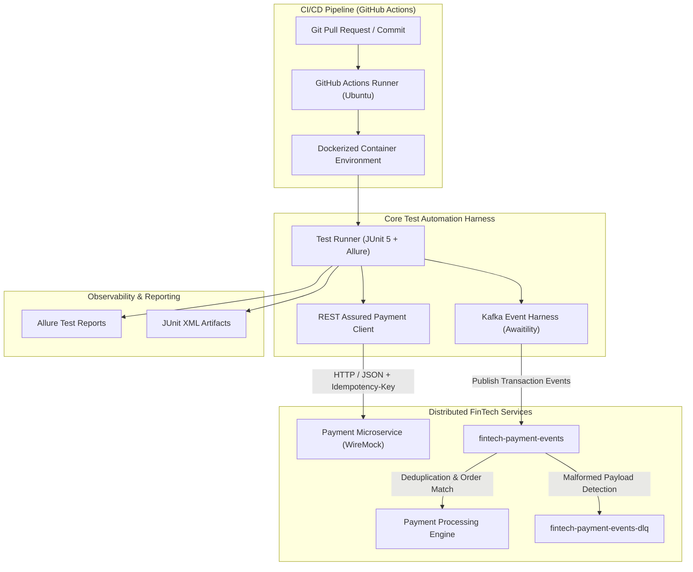

# FinTech Test Platform & Distributed Systems Harness

[](https://github.com/itfreesource-academy/fintech-test-platform-harness/actions)


An enterprise-grade test automation platform and testing harness designed for **distributed FinTech microservices**, **asynchronous Kafka & WebSocket payment streams**, and **containerized CI/CD pipelines** with **Allure, ReportPortal, Grafana**, and **Jira Xray / QMetry** enterprise traceability. 

Engineered by **[Vishal Prajapati](https://defendloop.io)** (*Senior Automation & Tools Development Engineer*) to showcase production patterns for high-scale, mission-critical financial systems.

---

## 🏛️ Architecture Overview



---

## 🎯 Core Capabilities Demonstrated

### 1. Financial Idempotency & Deduplication Testing
* **The Problem:** In high-volume financial platforms (processing $250B+ annually), network timeouts cause clients to retry requests, risking double-charging users.
* **The Harness Solution:** Test cases validate that duplicate requests transmitting the same `Idempotency-Key` are recognized, returning the original transaction with status `200 OK` without creating duplicate ledger records.

### 2. Asynchronous Kafka Stream Assertions with Awaitility
* **The Problem:** Event-driven architectures are asynchronous; traditional `Thread.sleep()` creates brittle, slow, and flaky tests.
* **The Harness Solution:** Custom `KafkaTestHarness` uses **Awaitility** polling to asynchronously assert event arrival, payload integrity, and schema compliance within a strict 2-second SLA.

### 3. Dead Letter Queue (DLQ) & Fault Tolerance
* Validates that corrupted, unparseable, or malformed transaction events are intercepted and routed to `fintech-payment-events-dlq` to prevent consumer group blocking.

### 4. OAuth 2.0 Client Credentials Token Management
* Built-in `OAuthTokenManager` implements RFC 6749 client credentials flow with thread-safe access token caching, automatic expiration detection (with 30s buffer), and automated renewal against WireMock identity providers.

### 5. Shift-Left API Security & Negative Testing
* Validates negative business logic (e.g., `422 Unprocessable Entity` on insufficient funds) and intercepts security regressions (`401 Unauthorized` on missing/expired Bearer tokens).

### 6. Multi-Service Container Orchestration
* Features both a multi-stage `Dockerfile` and a `docker-compose.yml` defining an isolated multi-service test environment (Kafka Broker + KRaft, mock microservices, and test runner container).

### 7. Real-Time WebSocket & Payment Notification Validation
* Features parallel test clients establishing WebSocket connections to test streaming transaction notifications, connection recovery, and backpressure handling.

### 8. Enterprise Observability & Test Traceability (ReportPortal, Grafana, Xray & QMetry)
* Integrates automated test execution telemetry with **ReportPortal** for ML-driven test analysis, pushes test health metrics to **Grafana**, and syncs pass/fail test results to **Jira Xray** and **QMetry Test Management**.

---

## 📂 Project Structure

```
fintech-test-platform-harness/
├── .github/
│   └── workflows/
│       └── ci.yml                 # Automated GitHub Actions CI pipeline
├── .mvn/wrapper/                  # Maven Wrapper binaries
├── src/
│   ├── main/java/io/defendloop/fintech/
│   │   ├── api/
│   │   │   └── PaymentApiClient.java     # Reusable REST Assured client wrapper
│   │   ├── auth/
│   │   │   └── OAuthTokenManager.java    # Thread-safe OAuth 2.0 token manager & cache
│   │   ├── kafka/
│   │   │   └── KafkaTestHarness.java     # Reusable Kafka event testing utility
│   │   └── model/
│   │       └── PaymentTransaction.java   # Domain model & Builder pattern
│   └── test/java/io/defendloop/fintech/
│       ├── api/
│       │   └── PaymentApiTest.java       # WireMock + REST Assured test suite
│       ├── auth/
│       │   └── OAuthSecurityTest.java    # OAuth 2.0 Client Credentials & caching suite
│       └── kafka/
│           └── PaymentEventStreamTest.java # Kafka event stream & DLQ test suite
├── Dockerfile                     # Multi-stage containerized test runner
├── docker-compose.yml             # Local Kafka + Service orchestration
├── mvnw / mvnw.cmd                # Cross-platform Maven Wrapper scripts
├── pom.xml                        # Maven dependency & plugin configuration
└── README.md
```

---

## 🚀 Running the Test Harness

### Option A: Local Execution via Maven
```bash
# Clone the repository
git clone https://github.com/itfreesource-academy/fintech-test-platform-harness.git
cd fintech-test-platform-harness

# Run all test suites
mvn clean test

# View Allure Test Report
mvn allure:serve
```

### Option B: Containerized Execution via Docker
```bash
# Build and run the test container
docker build -t fintech-test-runner .
docker run --rm fintech-test-runner
```

---

## 🔮 Future Roadmap & Upcoming Features (TODO)
- [ ] **Confluent Cloud & Managed Kafka Integration:**
  - Add SASL_SSL / API-key credential provider to run automated test suites against managed **Confluent Cloud** clusters alongside local KRaft containers.
- [ ] **Confluent Schema Registry & Avro Serialization:**
  - Integrate Confluent Schema Registry client to validate schema evolution (BACKWARD/FULL compatibility) and binary Avro/JSON schema validation across financial events.
- [ ] **Consumer Group Lag & Rebalance Testing:**
  - Implement automated test assertions verifying consumer group lag metrics and partition rebalance resiliency during simulated high-throughput transaction bursts.

---

## 👤 Author
* **Vishal Prajapati** — *Senior Associate: Test Automation & Tools Development Engineer*
* **Portfolio:** [defendloop.io](https://defendloop.io)
* **LinkedIn:** [linkedin.com/in/vishalprajapati2k25](https://www.linkedin.com/in/vishalprajapati2k25)
* **Education & Community:** Founder of [ITFreeSource Academy](https://academy.itfreesource.com)
